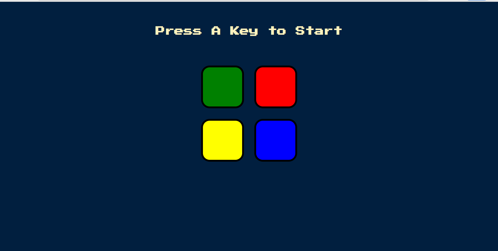

# Simon
A small website to play Siman game.
Simon is an electronic game of short-term memory skill invented by Ralph H. Baer and Ho.  The device creates a series of tones and lights and requires a user to repeat the sequence. If the user succeeds, the series becomes progressively and more complex. Once the user fails o, the game is over. 

# Languages used
+ HTML5
+ CSS
+ JavaSctipt(DOM manipulation)

# Front-End Frameworks
+ Jquery -JavaScript

# Authors 
Islam Abdelghaffar

# Reference
The Complete 2020 Web Development Bootcamp by Angela Yu

